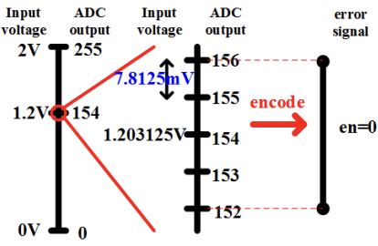
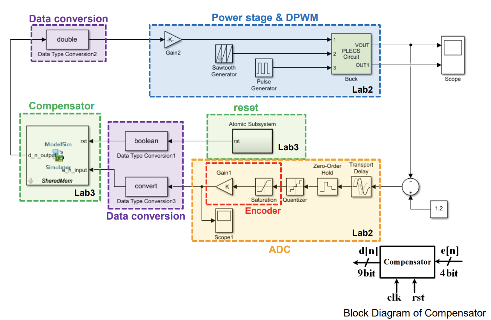

# ADC Encoder

## Objectives
1. **Integrate ADC Encoder**: Add an ADC encoder to replace the original ADC limits module and enhance the functionality of the system
2. **Simulate Digital Buck Converter with Closed-Loop Control**: Verify the combined system design, including ADC, compensator, DPWM, and power stage, under steady-state and load transition conditions

## System Specification
| Parameter                         | Symbol                  | Size                  |
|-----------------------------------|-------------------------|-----------------------|
| Input Voltage                     |  Vg                    | 6 V                   |
| Output Voltage                    |  Vo                     | 1 V                   |
| Switching Frequency               |  fs                    | 500 kHz               |
| Output Current                    |  Io                     | 500 mA - 1 A          |
| Steady State Output Voltage Ripple| \( \Delta V_{OSS} \)    | < 2%                  |
| Steady State Inductor Current Ripple | \( \Delta I_{LSS} \) | < 0.3 A (30% Io_max) |
| OS%                               |                        | < 10%                 |
| Inductance                        | L              | 10 µH                 |
| Inductor Parasitic Resistance     | RL              | 68 mΩ                 |
| Capacitance                       | C               | 22 µF                 |
| Capacitor Parasitic Resistance    | RC              | 20 mΩ                 |

## Design process
1. Integrate the ADC encoder to process sampled signals and replace the original ADC limits module (In this project, we use the AD7822 as the ADC)
2. Configure the clock divider and sample control module to achieve the required timing for the system.
3. Adjust data type conversions and quantization intervals to match the 8-bit specification.
4. Deisgn the power stage 
5. Combine all modules, including the compensator, DPWM, encoder, and ADC, into a closed-loop simulation.
6. Validate the design under steady-state and load transition conditions to ensure compliance with specifications.
## AD7822 Overview
- Datasheet: http://www.analog.com/static/imported-files/data_sheets/AD7822_7825_7829.pdf
- 8-bit half-flash ADC with a 420 ns conversion time
- **Supply voltage ranges**: 3V ± 10% and 5V ± 10%
- **Input voltage ranges**: 0V to 2𝑉𝑝−𝑝, 𝑉𝐷𝐷 = 3V ± 10%, 0V to 2.5𝑉𝑝−𝑝, 𝑉𝐷𝐷 = 5V ± 10%
- Need to output encoded values from the ADC

- For a 2 V input voltage range, the ADC output corresponds to values from 0 to 255

## Design Schematic

