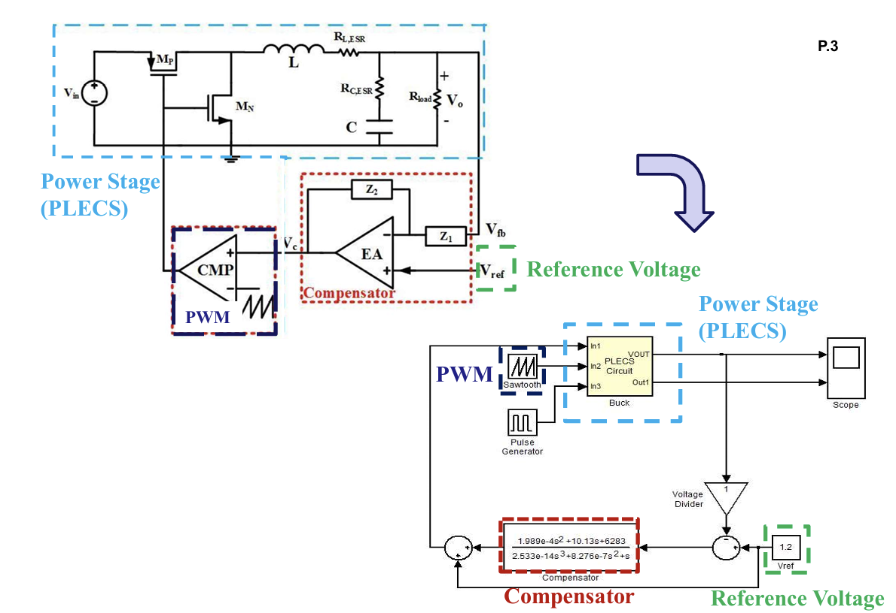

# Analog Voltage Mode Buck DC-DC Converter

## Objectives
1. Design analog voltage mode buck converter with Matlab SISOTool
2. Simulate the closed-loop system with PLECS and Matlab Simulink
- **PLECS**: Buck power stage model
- **Matlab Simulink**: Controller behavior model

## System Specification
| Parameter                         | Symbol                  | Size                  |
|-----------------------------------|-------------------------|-----------------------|
| Input Voltage                     |  Vg                    | 6 V                   |
| Output Voltage                    |  Vo                     | 1 V                   |
| Switching Frequency               |  fs                    | 500 kHz               |
| Output Current                    |  Io                     | 500 mA - 1 A          |
| Steady State Output Voltage Ripple| \( \Delta V_{OSS} \)    | < 2%                  |
| Steady State Inductor Current Ripple | \( \Delta I_{LSS} \) | < 0.3 A (30% Io_max) |
| OS%                               |                        | < 10%                 |
| Inductance                        | L              | 10 µH                 |
| Inductor Parasitic Resistance     | RL              | 68 mΩ                 |
| Capacitance                       | C               | 22 µF                 |
| Capacitor Parasitic Resistance    | RC              | 20 mΩ                 |

# Design Schematic

