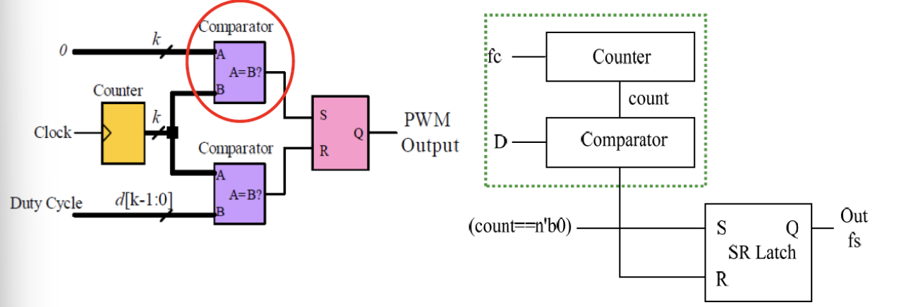
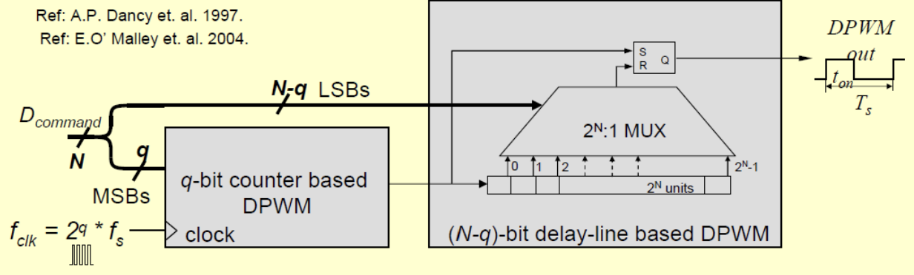
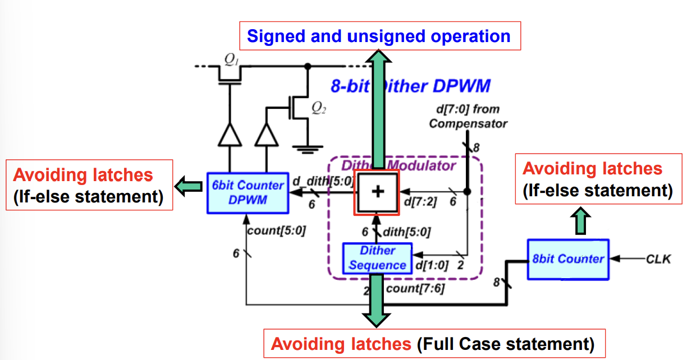
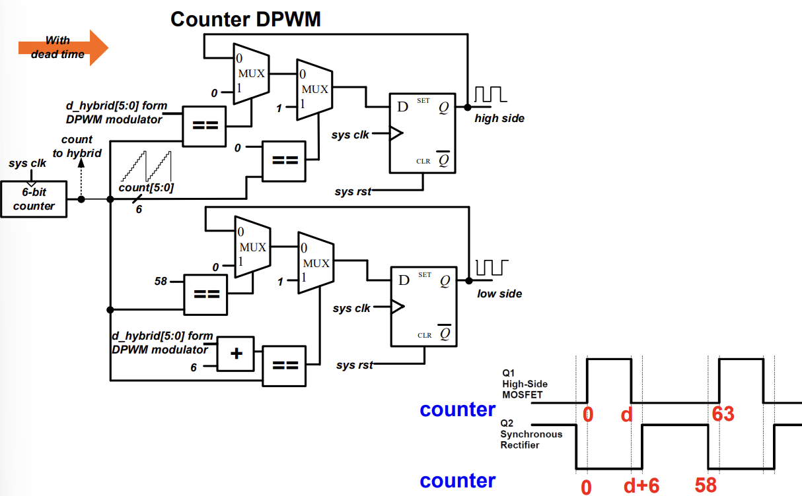

# Realization of DPWM

## Objectives
1. 9bit Counter-based DPWM
2. 9bit Hybrid DPWM
3. 9bit Dither DPWM
4. 9bit Dither DPWM with dead-time

## Design structure & Process
- 9bit Counter-based DPWM
  - Realize with a counter, 2 comparators and a SR latch
    
- 9bit Hybrid DPWM
  - Realize with mixture of a 6bits DPWM nad a 3bits delay line
     
- 9bit Dither DPWM
  - **Top module**: The duty signal output from the compensator first enters the dither system and the first 6 bits are taken during the cycle. After processing, they are input to the 6-bit format.
  - **Clk**: First divide the input clock frequency using a counter to match the required 1 MHz frequency for the Dither module. Then, implement the logic in Verilog to toggle the clock signal and reset the counter appropriately when it reaches the specified value.
counter DPWM for processing
  - Schematic (use 8bits Dither DPWM as an example)
    
- 9bit Dither DPWM with dead-time
  - Use a counter to track clock cycles and generate duty cycle signals by comparing the counter value to predefined thresholds for high and low states
  - Implement two comparators (duty_high and duty_low) to control the PWM output while ensuring a dead-time is maintained to prevent overlap.
  - Schematic (use 8bits Dither DPWM as an example)
    

