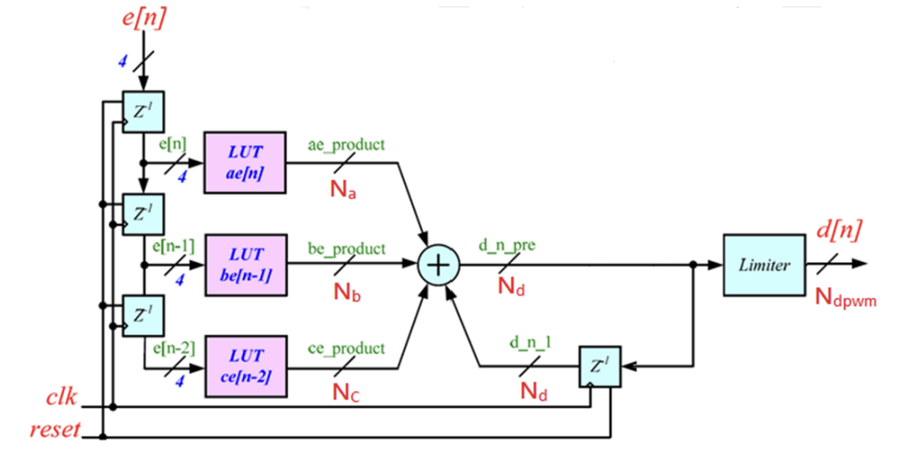

# Digitally PID Compensator Implement

## Objectives
1. Z-domain compensator quantization
2. Coding with Verilog-HDL for digital compensator
3. Co-Simulation with Matlab/Modelsim

## System Specification
| Parameter                         | Symbol                  | Size                  |
|-----------------------------------|-------------------------|-----------------------|
| Input Voltage                     |  Vg                    | 6 V                   |
| Output Voltage                    |  Vo                     | 1 V                   |
| Switching Frequency               |  fs                    | 500 kHz               |
| Output Current                    |  Io                     | 500 mA - 1 A          |
| Steady State Output Voltage Ripple| \( \Delta V_{OSS} \)    | < 2%                  |
| Steady State Inductor Current Ripple | \( \Delta I_{LSS} \) | < 0.3 A (30% Io_max) |
| OS%                               |                        | < 10%                 |
| Inductance                        | L              | 10 µH                 |
| Inductor Parasitic Resistance     | RL              | 68 mΩ                 |
| Capacitance                       | C               | 22 µF                 |
| Capacitor Parasitic Resistance    | RC              | 20 mΩ                 |

## Design process
1. Choose the word-length of the LUTs
2. Convert the compensator coefficients into binary form
   - Necessary to shift the decimal numbers forward, convert them into binary, and then revert them afterward
   - The precision of the conversion is positively correlated with the bit-shift amount
   - The bit-shift amount must match the number of bits required for the LUT.
3. Multiply the coefficients with the input results to determine the number of bits and the internal value of LUT
4. Build the Verilog code of digital compensator
   - Modulate the integer number to be consistent with the LUT results
   - Fill in the results in the Look-up-table
   - truncation
   - Hardware Implementation structure
     
5. Build Matlab Model with Modelsim
6. Co-Simulation with Matlab/Modelsim
   - Buck converter closed-loop simulation (including power stage, PWM, 
compensator)

## Design Schematic

