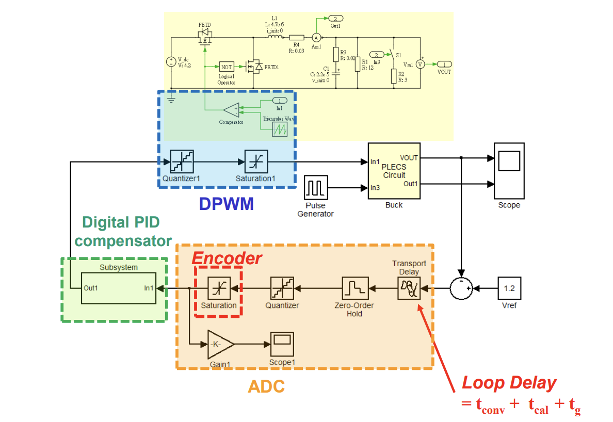

# Digitally Controlled Voltage Mode Buck Converter

## Objectives
1. Design an digital voltage mode buck converter
- ADC, DPWM selection
2. Design an digital compensator with Matlab SISOTool
- Design by Emulation (DBE) Flow
3. Construct Simulink behavior model of digital buck converter with PLECS and Matlab Simulink
4. Evaluate LCO
- Static situation (A1, A2)
- Dynamic situation (B1, B2)

## System Specification
| Parameter                         | Symbol                  | Size                  |
|-----------------------------------|-------------------------|-----------------------|
| Input Voltage                     |  Vg                    | 6 V                   |
| Output Voltage                    |  Vo                     | 1 V                   |
| Switching Frequency               |  fs                    | 500 kHz               |
| Output Current                    |  Io                     | 500 mA - 1 A          |
| Steady State Output Voltage Ripple| \( \Delta V_{OSS} \)    | < 2%                  |
| Steady State Inductor Current Ripple | \( \Delta I_{LSS} \) | < 0.3 A (30% Io_max) |
| OS%                               |                        | < 10%                 |
| Inductance                        | L              | 10 µH                 |
| Inductor Parasitic Resistance     | RL              | 68 mΩ                 |
| Capacitance                       | C               | 22 µF                 |
| Capacitor Parasitic Resistance    | RC              | 20 mΩ                 |

## Design process
1. Explore the design considerations for ADC & DWPM module

2. Design digital compensator using Design by Emulation (DBE) Flow
   -DBE flow detaol

4. Create a Matlab/Simulink simulation to verify the correctness of the Buck converter with the compensator in both steady and transient states.
## Design Schematic

